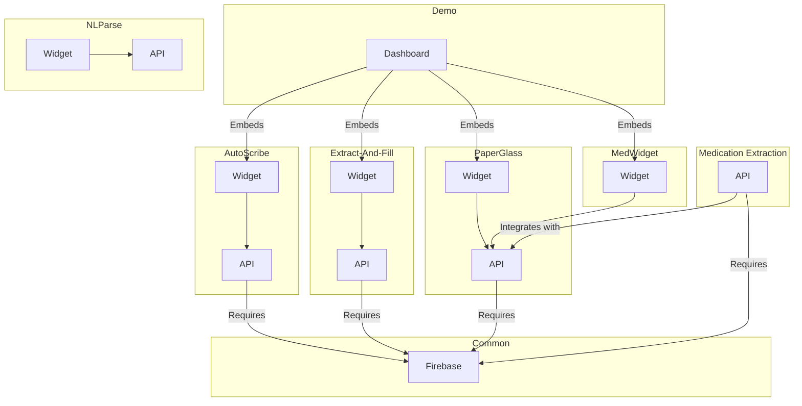

# VIKI AI

To install WellSky-DLS: See the following link for instructions on how to install the WellSky-DLS NPM packages:
https://wellsky.atlassian.net/wiki/spaces/~7120201d52cd4e20bb4407a33504bf83b3558f/pages/364021567/Information+on+Installation+of+WellSky+Github+NPM+Packages

A monorepo for VIKI applications.

| Application                                 | Component   | Dev info       |
| ------------------------------------------- | ----------- | -------------- |
| **[notebooks](./notebooks/)**               | -           | -              |
| **[autoscribe](./autoscribe/)**             | `api`       | port `11000`   |
|                                             | `widget`    | port `11001`   |
| **[extract-and-fill](./extract-and-fill/)** | `api`       | port `12000`   |
|                                             | `widget`    | port `12001`   |
| ~~[formographer](./formographer/)~~         | `api`       | _(deprecated)_ |
|                                             | `widget`    | _(deprecated)_ |
| **[demo](./demo/)**                         | `api`       | port `13000`   |
|                                             | `dashboard` | port `13001`   |
| **[nlparse](./nlparse/)**                   | `api`       | port `14000`   |
|                                             | `widget`    | port `14001`   |
| **[paperglass](./paperglass/)**             | `api`       | port `15000`   |
|                                             | `widget`    | port `15001`   |
| **[frontends](./frontends/)**               | `medwidget` | port `16001`   |
| **[medication_extraction](./medication_extraction/)** | `api`       | port `17000`   |

## Quick start

Requirements:

- [Docker](https://docs.docker.com/get-docker/)
- [docker-compose](https://docs.docker.com/compose/install/) 2.x.x
- Access to viki-dev-app-wsky project

### Initial one-time setup

[Instructions for Windows/WSL](README-WSL.md)

```sh
# Set default project
gcloud config set project viki-dev-app-wsky

# Ask your teammate for .envrc and put it in this repo's root
cp /path/to/.envrc .

# Copy .npmrc everywhere (because npm cannot find it in parent directories)
make configure
```

### Running everything

```sh
# Obtain credentials for GCP CLI utils (gcloud/gsutil/etc)
# gcloud auth login

# Install make for windows.
# https://stackoverflow.com/questions/32127524/how-to-install-and-use-make-in-windows
choco install make

# Obtain credentials for our applications (Python libraries etc)
# for medication extraction to talk to alloy db (deployed in private subnet) we need tunnelling into VPC from local
make login

# Run this one (robocopy) for windows from current user's directory in Command Prompt in different window.
robocopy %APPDATA%\gcloud .config\gcloud /E /MIR /mon:1

# Run all applications
# Now open Docker desktop if you're using Docker Desktop to manage docker runtime.
# If using windows run this command from git bash
make run
```

## Component relationships



## Contributing guide

See [CONTRIBUTING](./CONTRIBUTING.md) for details.

## Note on Mac and Docker issues

Mac users with Docker desktop will run into many problems. Read https://dev.to/ericnograles/why-is-docker-on-macos-so-much-worse-than-linux-flh to understand the same.

Please follow https://dev.to/elliotalexander/how-to-use-docker-without-docker-desktop-on-macos-217m as an alternative

1. brew install colima
2. colima start
3. sudo ln ~/.colima/default/docker.sock /var/run [if the docker doesnt start after step # 1 and 2]

After above steps, docker-compose might still trouble you due to a mount related issue. It needs full path to mount and relative path such as $HOME doesn't work. If you face the same, follow below steps to be run the whole setup (Note: its painfull so best is to spend some time and make docker-compose work)
Note: Colima 0.6.7 solves docker-compose mounting issues
