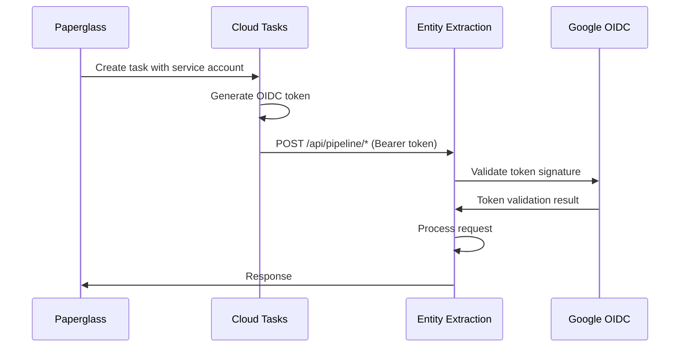

# Entity Extraction API Security

This document describes the security implementation for the Entity Extraction API, including OIDC token validation and service account authentication.

## Overview

The Entity Extraction API implements security through Google OIDC token validation for service-to-service authentication. Security is conditionally applied based on the deployment environment:

- **Cloud Environment** (`CLOUD_PROVIDER != "local"`): Full OIDC token validation required
- **Local Development** (`CLOUD_PROVIDER == "local"`): Authentication bypassed for easier development

## Security Architecture

### Components

1. **OIDC Validator** (`util/oidc_validator.py`)
   - Validates Google OIDC tokens from Cloud Tasks
   - Verifies token signature, expiration, issuer, and audience
   - Caches validation results for performance

2. **Security Middleware** (`middleware/security.py`)
   - FastAPI dependency for endpoint authentication
   - Conditional security based on environment
   - Comprehensive logging and error handling

3. **Secured Endpoints**
   - Pipeline execution endpoints (`/api/pipeline/*`)
   - Configuration management endpoints (`/api/config/*`)
   - Distributed Job Tracking status endpoints (`/api/status/*`)

### Authentication Flow



## Implementation Details

### OIDC Token Validation

The `OIDCValidator` class performs comprehensive token validation:

```python
# Token validation includes:
- Signature verification using Google's public keys
- Expiration time check
- Issuer verification (https://accounts.google.com)
- Audience verification (SERVICE_ACCOUNT_EMAIL)
- Clock skew tolerance (60 seconds)
```

### Security Dependency Usage

Endpoints are secured using FastAPI's dependency injection:

```python
@router.post("/{scope}/{pipeline_key}/start")
async def start_pipeline(
    scope: str, 
    pipeline_key: str, 
    pipeline_params: PipelineParameters, 
    request: Request,
    auth_info: Dict[str, Any] = Depends(require_service_account_auth)  # Security annotation
):
```

### Environment-Based Security

Security behavior changes based on the `CLOUD_PROVIDER` setting:

| Environment | CLOUD_PROVIDER | Security Behavior |
|-------------|----------------|-------------------|
| Local Development | `"local"` | Authentication bypassed |
| Google Cloud | `"gcp"` | Full OIDC validation |
| Other Cloud | `"aws"`, `"azure"`, etc. | Full OIDC validation |

## Configuration

### Required Environment Variables

```bash
# Core settings
CLOUD_PROVIDER=gcp                    # Controls security behavior
SERVICE_ACCOUNT_EMAIL=sa@project.iam  # Expected token audience

# Optional settings for local development
CLOUD_PROVIDER=local                  # Bypasses authentication
```

### Dependencies

The following Python packages are required:

```toml
dependencies = [
    "pyjwt[crypto]>=2.8.0",  # JWT token validation
    "fastapi>=0.109.0",      # Web framework
    # ... other dependencies
]
```

## Security Features

### Token Validation
- **Signature Verification**: Uses Google's public keys via JWKS endpoint
- **Expiration Check**: Validates `exp` claim with clock skew tolerance
- **Issuer Validation**: Ensures token issued by Google (`https://accounts.google.com`)
- **Audience Validation**: Verifies token intended for our service account

### Caching
- **JWKS Caching**: Public keys cached for 1 hour
- **Discovery Document Caching**: OIDC configuration cached for 1 hour
- **Performance**: Reduces external API calls and improves response times

### Error Handling
- **401 Unauthorized**: Missing or invalid tokens
- **500 Internal Server Error**: Unexpected validation errors
- **Comprehensive Logging**: All security events logged with context

### Logging
All security events include structured logging:

```json
{
  "function": "require_service_account_auth",
  "cloud_provider": "gcp",
  "endpoint": "/api/pipeline/test/start",
  "method": "POST",
  "authentication_status": "success",
  "service_account": "sa@project.iam.gserviceaccount.com"
}
```

## Testing

### Unit Tests

Run the security test suite:

```bash
# Run all security tests
pytest tests/test_security.py -v

# Run specific test categories
pytest tests/test_security.py::TestSecurityMiddleware -v
pytest tests/test_security.py::TestOIDCValidator -v
```

### Test Coverage

The test suite covers:
- Local environment bypass
- Missing credentials handling
- Valid token authentication
- Invalid token rejection
- Unexpected error handling
- Token extraction utilities

### Manual Testing

#### Local Development
```bash
# Set local environment
export CLOUD_PROVIDER=local

# Start service
uvicorn main:app --reload

# Test endpoint (no auth required)
curl -X POST http://localhost:8000/api/pipeline/test/test/start \
  -H "Content-Type: application/json" \
  -d '{"document_uri": "gs://bucket/file.pdf"}'
```

#### Cloud Environment
```bash
# Set cloud environment
export CLOUD_PROVIDER=gcp

# Test with valid token (from Cloud Tasks)
curl -X POST https://entity-extraction.example.com/api/pipeline/test/test/start \
  -H "Authorization: Bearer $VALID_OIDC_TOKEN" \
  -H "Content-Type: application/json" \
  -d '{"document_uri": "gs://bucket/file.pdf"}'

# Test without token (should return 401)
curl -X POST https://entity-extraction.example.com/api/pipeline/test/test/start \
  -H "Content-Type: application/json" \
  -d '{"document_uri": "gs://bucket/file.pdf"}'
```

## Security Considerations

### Production Deployment
1. **Environment Variables**: Ensure `CLOUD_PROVIDER` is set correctly
2. **Service Account**: Configure proper service account with minimal permissions
3. **Network Security**: Use VPC and firewall rules to restrict access
4. **Monitoring**: Monitor authentication failures and security events

### Development Guidelines
1. **Local Testing**: Use `CLOUD_PROVIDER=local` for development
2. **Token Testing**: Use Cloud Tasks emulator or generate test tokens
3. **Error Handling**: Always handle authentication errors gracefully
4. **Logging**: Include authentication context in all log messages

### Known Limitations
1. **Token Refresh**: No automatic token refresh (handled by Cloud Tasks)
2. **Revocation**: No real-time token revocation checking
3. **Rate Limiting**: No built-in rate limiting (should be handled at infrastructure level)

## Troubleshooting

### Common Issues

#### Authentication Bypassed in Production
**Problem**: Security not enforced in production
**Solution**: Verify `CLOUD_PROVIDER` environment variable is not set to `"local"`

#### Token Validation Failures
**Problem**: Valid tokens being rejected
**Solution**: 
- Check `SERVICE_ACCOUNT_EMAIL` matches token audience
- Verify system clock synchronization
- Check network connectivity to Google OIDC endpoints

#### Missing Dependencies
**Problem**: Import errors for JWT libraries
**Solution**: Install required dependencies: `pip install pyjwt[crypto]`

### Debug Logging

Enable debug logging to troubleshoot authentication issues:

```python
import logging
logging.getLogger("middleware.security").setLevel(logging.DEBUG)
logging.getLogger("util.oidc_validator").setLevel(logging.DEBUG)
```

## Future Enhancements

### Planned Improvements
1. **Token Refresh**: Automatic token refresh for long-running operations
2. **Rate Limiting**: Built-in rate limiting per service account
3. **Audit Logging**: Enhanced security audit trail
4. **Multi-Tenant**: Support for multiple service accounts/tenants

### Security Roadmap
1. **mTLS**: Mutual TLS for additional transport security
2. **API Keys**: Alternative authentication method for specific use cases
3. **RBAC**: Role-based access control for different operations
4. **Monitoring**: Integration with security monitoring systems
