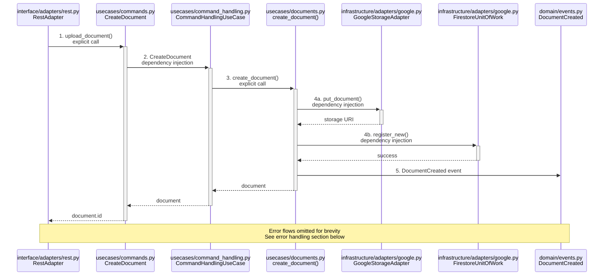
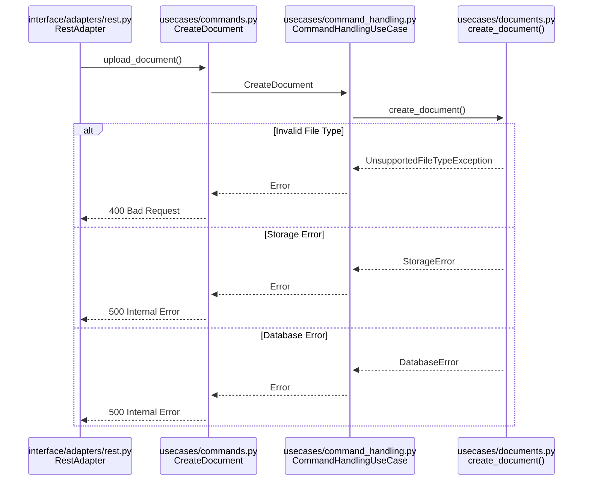
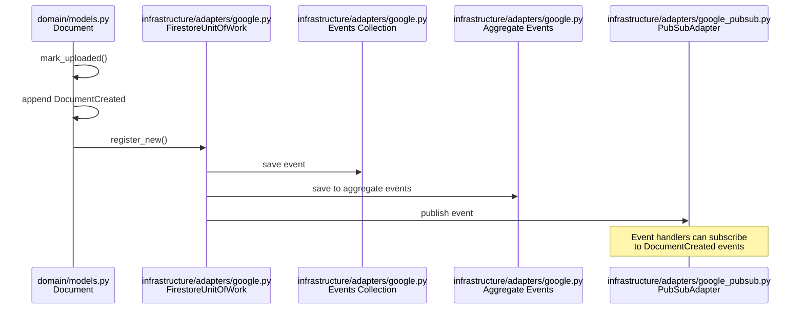

# Document Upload Flow Implementation

## Overview
This document details the implementation flow for document upload functionality in the PaperGlass API, showing the exact path from HTTP endpoint to persistence layer including all files, methods and mechanisms involved.

## Flow Diagram



## Error Handling Flow



## Detailed Implementation Flow

### 1. HTTP Layer
**File:** `paperglass/interface/adapters/rest.py`
**Class:** `RestAdapter`
**Method:** `upload_document`
```python
@decode_token
@inject
async def upload_document(self, request: Request, commands: ICommandHandlingPort):
    # Get uploaded file from form
    form = await request.form()
    file = form['file']
    file_name = file.filename
    
    # Get metadata from decoded token
    app_id = request['app_id']
    tenant_id = request['tenant_id']
    patient_id = request['patient_id']
    token = request['token']
    
    # Execute command
    result = await commands.handle_command(
        CreateDocument(
            token=token,
            app_id=app_id,
            tenant_id=tenant_id,
            file_name=file_name, 
            file=await file.read(),
            patient_id=patient_id
        )
    )
    return JSONResponse({'id': result.id})
```
**Mechanisms:**
- `@decode_token`: Decorator that extracts metadata from auth token
- `@inject`: Dependency injection decorator for ICommandHandlingPort
- Explicit command creation and execution

### 2. Command Layer
**File:** `paperglass/usecases/commands.py`
**Class:** `CreateDocument`
```python
class CreateDocument(BaseCommand):
    type: str = Field('create_document', const=True)
    app_id: str
    tenant_id: str
    patient_id: str
    file_name: str
    file: Any  # type: BinaryIO
    token: Optional[str] = None
    source_storage_uri: Optional[str] = None
    source: Optional[Literal['app','host']] = 'app'
```
**Mechanisms:**
- Pydantic model for command validation
- Field constraints and typing

### 3. Command Handler Layer
**File:** `paperglass/usecases/command_handling.py`
**Class:** `CommandHandlingUseCase`
```python
@inject
async def create_document(command: CreateDocument, uow: IUnitOfWork, storage: IStoragePort):
    try:
        # Call usecase layer
        document = await create_document(
            command.app_id,
            command.tenant_id,
            command.patient_id,
            command.file_name,
            command.file,
            command.token,
            storage
        )
        document.execution_id = command.execution_id
        document.source_storage_uri = command.source_storage_uri
        document.source = command.source
        uow.register_new(document)
        return document
    except UnsupportedFileTypeException as e:
        raise e
```
**Mechanisms:**
- `@inject`: Dependency injection for IUnitOfWork and IStoragePort
- Exception handling
- Transaction management via unit of work pattern

### 4. Usecase Layer
**File:** `paperglass/usecases/documents.py`
**Function:** `create_document`
```python
async def create_document(app_id, tenant_id, patient_id, file_name, uploaded_bytes, token, storage: IStoragePort):
    # Validate and process file
    if file_name.endswith('.pdf'):
        # Process PDF
        pdf_reader = pypdf.PdfReader(BytesIO(uploaded_bytes))
        pages = []
        for page in pdf_reader.pages:
            pages.append(Page(...))
        final_filename = file_name
        final_data = uploaded_bytes
    elif any(file_name.endswith(ext) for ext in AUTO_CONVERT_IMAGE_TYPES):
        # Convert image to PDF
        image = Image.open(BytesIO(uploaded_bytes))
        # ... image processing ...
        final_filename = file_name.rpartition('.')[0] + '.pdf'
        final_data = pdf_output.getvalue()
    else:
        raise UnsupportedFileTypeException()

    # Create domain model
    document = Document.create(app_id, tenant_id, patient_id, final_filename, pages)
    document.token = token
    
    # Store in GCS
    uri = await storage.put_document(app_id, tenant_id, patient_id, document.id, final_data)
    document.mark_uploaded(uri)
    return document
```
**Mechanisms:**
- Dependency injection for IStoragePort
- Domain model creation
- File type validation and conversion
- Storage interaction via port interface

### 5. Infrastructure Layer
**File:** `paperglass/infrastructure/adapters/google.py`
**Class:** `GoogleStorageAdapter`
```python
class GoogleStorageAdapter(IStoragePort):
    def __init__(self, project_id, bucket_name, cloud_provider):
        self.project_id = project_id
        self.bucket_name = bucket_name
        self.sync_client = storage.Client(project=project_id)

    async def put_document(self, app_id: str, tenant_id: str, patient_id: str, document_id: str, content: bytes) -> str:
        path = f"paperglass/documents/{app_id}/{tenant_id}/{patient_id}/{document_id}/document.pdf"
        bucket = self.sync_client.bucket(self.bucket_name)
        blob = bucket.blob(path)
        await asyncio.get_event_loop().run_in_executor(
            None,
            partial(blob.upload_from_string, content, content_type="application/pdf"),
        )
        return self._gcs_uri(path)
```
**Mechanisms:**
- Interface implementation
- Google Cloud Storage client
- Async execution of sync operations

**File:** `paperglass/infrastructure/adapters/google.py`
**Class:** `FirestoreUnitOfWorkManagerAdapter`
```python
class FirestoreUnitOfWorkManagerAdapter(IUnitOfWorkManagerPort):
    class FirestoreUnitOfWork(IUnitOfWork):
        def __init__(self, db_name):
            self.client = firestore.AsyncClient(database=db_name)
            self.transaction = self.client.transaction()
            self.documents_ref = self.client.collection("paperglass_documents")
            # ... other collections ...

        async def __aenter__(self):
            await self.transaction._begin()
            return self

        async def __aexit__(self, exc_type, exc_value, traceback):
            if not exc_type:
                # Commit changes
                for aggregate in chain(self.new, self.dirty, self.removed):
                    # ... handle changes ...
                await self.transaction._commit()
            else:
                await self.transaction._rollback()
```
**Mechanisms:**
- Interface implementation
- Transaction management
- Async context manager
- Firestore client

## Domain Model
**File:** `paperglass/domain/models.py`
**Class:** `Document`
```python
class Document(Aggregate):
    file_name: str
    storage_uri: Optional[str]
    page_count: int
    pages: List[PageModel]
    active: bool = True
    embedding_strategy: EmbeddingStrategy = EmbeddingStrategy.DOT_PRODUCT
    embedding_chunking_strategy: EmbeddingChunkingStartegy = EmbeddingChunkingStartegy.MARKDOWN_TEXT_SPLITTER
    token: Optional[str] = None
    source_storage_uri: Optional[str] = None
    source: Optional[Literal['host','app']] = 'app'

    @classmethod
    def create(cls, app_id: str, tenant_id: str, patient_id: str, file_name: str, pages: List[PageModel]) -> 'Document':
        id = uuid1().hex
        return cls(id=id, app_id=app_id, tenant_id=tenant_id, patient_id=patient_id,
                  file_name=file_name, page_count=len(pages), pages=pages)

    def mark_uploaded(self, storage_uri: str) -> None:
        if self.storage_uri:
            raise ValueError('Document already uploaded')
        self.storage_uri = storage_uri
        self.events.append(DocumentCreated(...))
```
**Mechanisms:**
- Pydantic model validation
- Domain events
- Aggregate pattern
- Factory method pattern

## Key Design Patterns & Mechanisms

1. **Dependency Injection**
   - Used extensively via `@inject` decorator
   - Injects command handlers, storage ports, unit of work

2. **Ports & Adapters (Hexagonal Architecture)**
   - IStoragePort -> GoogleStorageAdapter
   - IUnitOfWorkPort -> FirestoreUnitOfWork
   - ICommandHandlingPort -> CommandHandlingUseCase

3. **Unit of Work Pattern**
   - Manages transactions
   - Tracks aggregate changes
   - Handles commits/rollbacks

4. **Command Pattern**
   - Commands represent intentions
   - Validated via Pydantic
   - Handled by specific handlers

5. **Domain Events**
   - Generated on state changes
   - Tracked in aggregates
   - Persisted with changes

6. **Repository Pattern**
   - Abstracted by Unit of Work
   - Collections in Firestore
   - CRUD operations on aggregates

7. **Factory Pattern**
   - Document.create()
   - Clean object construction
   - Encapsulated ID generation

## Interface Definitions

### Command Handling Port
**File:** `paperglass/interface/ports.py`
```python
class ICommandHandlingPort(Protocol):
    async def handle_command(self, command: Command) -> Any:
        pass
```

### Storage Port
**File:** `paperglass/infrastructure/ports.py`
```python
class IStoragePort(Protocol):
    async def put_document(self, app_id: str, tenant_id: str, patient_id: str, document_id: str, content: bytes) -> str:
        pass
    
    async def get_document(self, app_id: str, tenant_id: str, patient_id: str, document_id: str) -> bytes:
        pass
```

### Unit of Work Port
**File:** `paperglass/infrastructure/ports.py`
```python
class IUnitOfWork(Protocol):
    async def __aenter__(self) -> 'IUnitOfWork':
        pass
        
    async def __aexit__(self, exc_type, exc_value, traceback) -> None:
        pass
        
    def register_new(self, entity: Any) -> None:
        pass
        
    def register_dirty(self, entity: Any) -> None:
        pass
```

## Event Handling Flow



The DocumentCreated event flow:
1. Document domain model creates event
2. Unit of Work saves event to:
   - Main events collection
   - Aggregate's events subcollection
3. Event is published to PubSub
4. Event handlers can:
   - Update search indexes
   - Trigger document processing
   - Send notifications
   - etc.

## Testing Strategy

### Unit Tests
**File:** `paperglass/tests/test_document.py`

1. **Domain Model Tests**
```python
def test_document_creation():
    document = Document.create(
        app_id="test", 
        tenant_id="test",
        patient_id="123",
        file_name="test.pdf",
        pages=[]
    )
    assert document.id is not None
    assert document.file_name == "test.pdf"

def test_mark_uploaded():
    document = Document.create(...)
    document.mark_uploaded("gs://bucket/path")
    assert document.storage_uri == "gs://bucket/path"
    assert len(document.events) == 1
    assert isinstance(document.events[0], DocumentCreated)
```

2. **Command Handler Tests**
```python
async def test_create_document_command():
    # Arrange
    storage_mock = Mock(IStoragePort)
    storage_mock.put_document.return_value = "gs://bucket/path"
    
    uow_mock = Mock(IUnitOfWork)
    
    command = CreateDocument(
        app_id="test",
        tenant_id="test",
        patient_id="123",
        file_name="test.pdf",
        file=b"test content"
    )
    
    # Act
    result = await create_document(command, uow_mock, storage_mock)
    
    # Assert
    assert result.id is not None
    assert result.storage_uri == "gs://bucket/path"
    assert uow_mock.register_new.called_once()
```

### Integration Tests
**File:** `paperglass/tests/test_document_operation.py`

```python
async def test_document_upload_flow():
    # Arrange
    storage = GoogleStorageAdapter(
        project_id="test",
        bucket_name="test-bucket",
        cloud_provider="local"
    )
    uow = FirestoreUnitOfWork(db_name="test")
    
    # Act
    async with uow:
        document = await create_document(
            app_id="test",
            tenant_id="test",
            patient_id="123",
            file_name="test.pdf",
            uploaded_bytes=b"test content",
            token="test",
            storage=storage
        )
        
        # Assert
        assert document.id is not None
        assert document.storage_uri is not None
        
        # Verify storage
        content = await storage.get_document(
            app_id="test",
            tenant_id="test",
            patient_id="123",
            document_id=document.id
        )
        assert content == b"test content"
        
        # Verify Firestore
        saved_doc = await uow.get(Document, document.id)
        assert saved_doc is not None
        assert saved_doc.storage_uri == document.storage_uri
```

### End-to-End Tests
**File:** `paperglass/tests/test_api.rest`

```http
### Upload Document
POST {{host}}/api/documents
Content-Type: multipart/form-data; boundary=boundary

--boundary
Content-Disposition: form-data; name="file"; filename="test.pdf"
Content-Type: application/pdf

< ./test.pdf
--boundary--

> 

### Verify Upload
GET {{host}}/api/documents/{{response.body.id}}

> 
```

The testing strategy covers:
1. Unit tests for domain models and command handlers
2. Integration tests for the complete flow
3. End-to-end API tests
4. Mock objects for isolation
5. Transaction handling in tests

## Storage Structure

1. **Google Cloud Storage**
   - Path: `paperglass/documents/{app_id}/{tenant_id}/{patient_id}/{document_id}/document.pdf`
   - Stores actual PDF content
   - Accessed via signed URLs

2. **Firestore**
   - Collection: `paperglass_documents`
   - Stores document metadata
   - Linked to GCS via storage_uri
