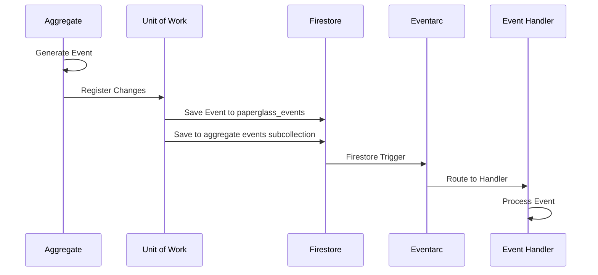

# Event Handling System Design

## Current Architecture

### 1. Event Flow


### 2. Key Components

#### 2.1 Event Definition (domain/events.py)
- Events are Pydantic models inheriting from BaseEvent
- Each event has unique ID, type, and creation timestamp
- Events are immutable (frozen=True)
- Example events:
  - DocumentCreated
  - PageSplitCreated
  - PageClassified

#### 2.2 Event Handling (usecases/event_handling.py)
- Uses singledispatch pattern for routing events
- Handlers are registered using @dispatcher.register decorator
- Async event processing with error handling
- Idempotency check before processing

#### 2.3 Storage (infrastructure/adapters/google.py)
- Events stored in two locations:
  1. Global events collection (paperglass_events)
  2. Aggregate event subcollections (for event sourcing)
- Firestore transactions ensure atomic operations
- Event processing status tracked in paperglass_events_processed

#### 2.4 Event Reception (interface/adapters/eventarc.py)
- Eventarc adapter receives events from Firestore triggers
- Supports both cloud and local environments
- Handles event deserialization and routing

### 3. Current Features

1. **Event Persistence**
   - Durable storage in Firestore
   - Event sourcing support via aggregate subcollections
   - Transaction-based consistency

2. **Processing Guarantees**
   - Exactly-once processing through tracking
   - Idempotent handlers
   - Transaction rollback on failures

3. **Environment Flexibility**
   - Local development support
   - Cloud deployment ready
   - Environment-specific optimizations

4. **Integration Points**
   - Firestore triggers
   - Cloud Tasks for throttling
   - OpenTelemetry instrumentation

## Recommendations for Improvement

### 1. Architecture Enhancements

1. **Event Versioning**
   ```python
   class BaseEvent(BaseModel):
       version: int = Field(1, const=True)
       # Existing fields...
   ```
   - Add version field to events
   - Support event schema evolution
   - Enable backward compatibility

2. **Event Validation**
   ```python
   class EventValidator:
       def validate(self, event: Event) -> List[ValidationError]:
           pass
   ```
   - Pre-processing validation
   - Business rule enforcement
   - Schema validation

3. **Dead Letter Queue**
   ```python
   class DeadLetterQueue:
       async def push(self, event: Event, error: Exception):
           pass
       async def retry(self, event_id: str):
           pass
   ```
   - Handle failed event processing
   - Support manual retry
   - Error investigation tools

### 2. Performance Optimizations

1. **Event Batching**
   ```python
   class EventBatch:
       events: List[Event]
       async def process(self):
           pass
   ```
   - Batch similar events
   - Reduce database operations
   - Optimize throughput

2. **Caching Layer**
   ```python
   class EventCache:
       async def get_processed_status(self, event_id: str) -> bool:
           pass
   ```
   - Cache processed event IDs
   - Reduce database lookups
   - Improve latency

3. **Parallel Processing**
   ```python
   class ParallelEventProcessor:
       async def process_events(self, events: List[Event]):
           pass
   ```
   - Process independent events concurrently
   - Utilize async capabilities
   - Maintain ordering when needed

### 3. Monitoring and Observability

1. **Event Metrics**
   ```python
   class EventMetrics:
       async def record_processing_time(self, event: Event, duration: float):
           pass
       async def record_error(self, event: Event, error: Exception):
           pass
   ```
   - Processing duration
   - Error rates
   - Queue depths

2. **Event Tracing**
   ```python
   class EventTracer:
       async def start_trace(self, event: Event) -> Trace:
           pass
       async def end_trace(self, trace: Trace):
           pass
   ```
   - End-to-end tracing
   - Dependency tracking
   - Performance analysis

3. **Event Logging**
   ```python
   class EventLogger:
       async def log_event_lifecycle(self, event: Event, stage: str):
           pass
   ```
   - Structured logging
   - Lifecycle tracking
   - Audit trail

### 4. Testing Improvements

1. **Event Test Helpers**
   ```python
   class EventTestKit:
       async def simulate_event(self, event: Event):
           pass
       async def verify_processing(self, event: Event):
           pass
   ```
   - Simplified event testing
   - Mocked dependencies
   - Verification utilities

2. **Event Replay**
   ```python
   class EventReplay:
       async def replay_events(self, from_date: datetime, to_date: datetime):
           pass
   ```
   - Test with production events
   - Debug issues
   - Verify fixes

### 5. Security Enhancements

1. **Event Encryption**
   ```python
   class EventEncryption:
       async def encrypt_sensitive_data(self, event: Event):
           pass
       async def decrypt_sensitive_data(self, event: Event):
           pass
   ```
   - Encrypt sensitive data
   - Key rotation support
   - Audit logging

2. **Event Authorization**
   ```python
   class EventAuthorization:
       async def authorize_event_processing(self, event: Event, context: Context):
           pass
   ```
   - Role-based access
   - Tenant isolation
   - Audit trails

## Implementation Priority

1. High Priority
   - Event versioning
   - Dead letter queue
   - Enhanced monitoring

2. Medium Priority
   - Performance optimizations
   - Testing improvements
   - Security enhancements

3. Low Priority
   - Event replay
   - Advanced caching
   - Batch processing

## Migration Strategy

1. Phase 1: Core Improvements
   - Add versioning to new events
   - Implement basic monitoring
   - Add dead letter queue

2. Phase 2: Performance
   - Introduce caching
   - Implement batching
   - Add parallel processing

3. Phase 3: Advanced Features
   - Security enhancements
   - Replay capability
   - Advanced monitoring

## Conclusion

The current event handling system provides a solid foundation with its use of domain events, reliable storage, and processing guarantees. The proposed improvements focus on enhancing reliability, performance, and observability while maintaining the existing architecture's strengths.

The recommendations aim to evolve the system gradually, ensuring backward compatibility and minimal disruption to existing functionality. Each enhancement adds value in terms of maintainability, scalability, or operational efficiency.