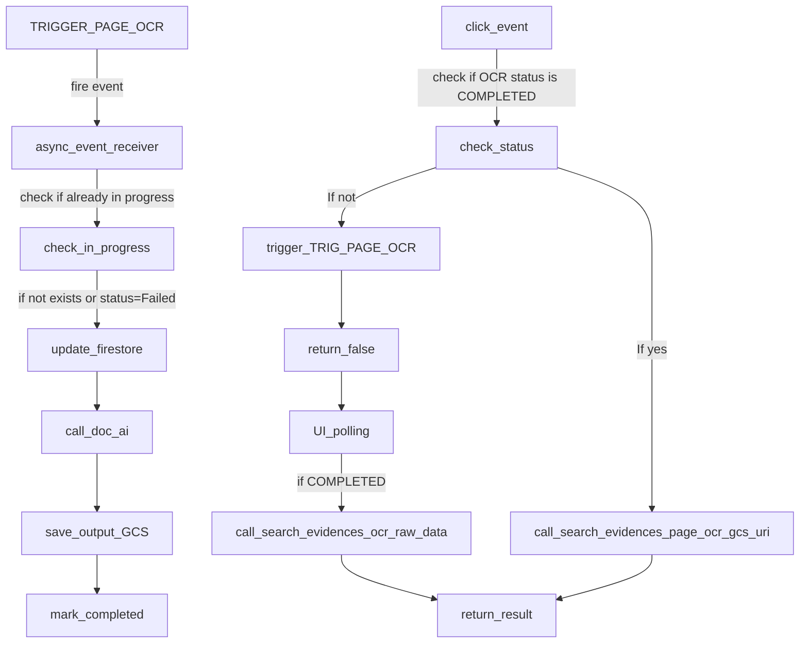

```mermaid
flowchart TD
    TRIGGER_PAGE_OCR -->|fire event| async_event_receiver
    async_event_receiver -->|check if already in progress| check_in_progress
    check_in_progress -->|if not exists or status=Failed| update_firestore
    update_firestore --> call_doc_ai
    call_doc_ai --> save_output_GCS
    save_output_GCS --> mark_completed

    click_event -->|check if OCR status is COMPLETED| check_status
    check_status -->|If not| trigger_TRIG_PAGE_OCR
    trigger_TRIG_PAGE_OCR --> return_false
    return_false --> UI_polling
    UI_polling -->|if COMPLETED| call_search_evidences_ocr_raw_data
    call_search_evidences_ocr_raw_data --> return_result

    check_status -->|If yes| call_search_evidences_page_ocr_gcs_uri
    call_search_evidences_page_ocr_gcs_uri --> return_result
```