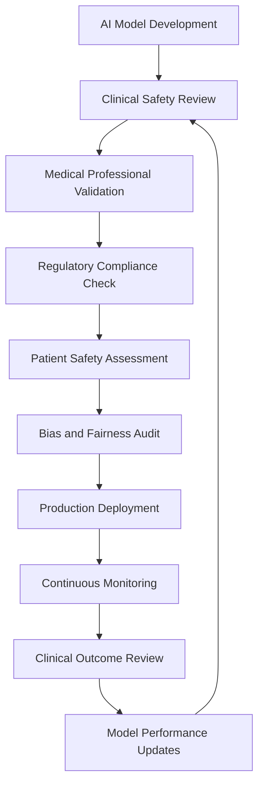
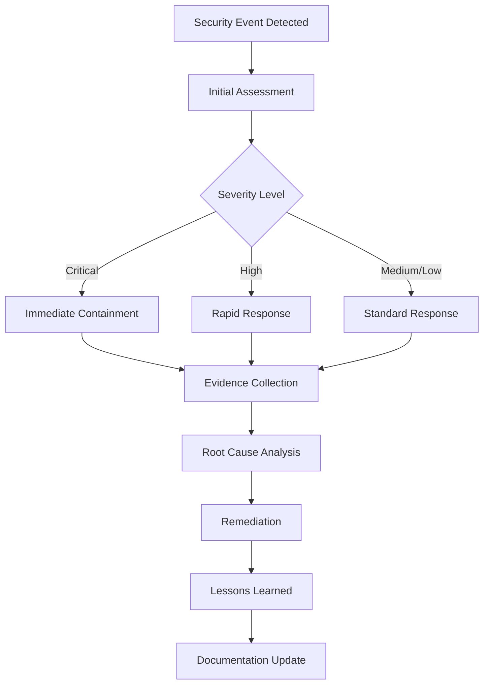

# VIKI AI Security Stance Document

## Document Information
- **Document Title**: VIKI AI Comprehensive Security Stance
- **Version**: 1.0
- **Publication Date**: August 26, 2025
- **Classification**: Internal Use - Technical Security Documentation
- **Scope**: VIKI AI Multi-Service Architecture
- **Next Review**: Upon architecture changes or security framework updates

---

## Executive Summary

This document establishes the comprehensive security stance for the VIKI AI system, a multi-service healthcare AI platform that processes medical transcriptions, documents, and extracts clinical entities. VIKI operates as a microservices architecture on Google Cloud Platform, handling sensitive healthcare data while providing AI-powered document analysis, medication extraction, and clinical entity recognition.

### Key Security Principles

1. **Defense in Depth**: Multi-layered security controls across all system components
2. **Zero Trust Architecture**: No implicit trust between services or users
3. **Privacy by Design**: Healthcare data protection integrated into system architecture
4. **Continuous Monitoring**: Real-time security event detection and response
5. **Responsible AI**: Comprehensive guardrails and safety measures for AI model outputs

### Security Objectives

- **Confidentiality**: Protect healthcare data and proprietary AI models
- **Integrity**: Ensure accuracy and reliability of AI processing pipelines
- **Availability**: Maintain system resilience and fault tolerance
- **Compliance**: Adhere to healthcare regulations and industry standards
- **Transparency**: Provide audit trails and explainable AI decisions

---

## System Architecture Security Assessment

### Architecture Overview

VIKI AI consists of seven primary microservices deployed on Google Cloud Platform:

| Service | Port | Primary Function | Security Risk Level |
|---------|------|------------------|-------------------|
| **AutoScribe** | 11000-11001 | Audio transcription and real-time streaming | High - Audio data processing |
| **Extract-and-Fill** | 12000-12001 | Document analysis and form extraction | High - Document content analysis |
| **PaperGlass** | 15000-15001 | Document search and evidence retrieval | High - Document access and search |
| **NLParse** | 14000-14001 | Natural language processing | Medium - Text analysis |
| **Medication Extraction** | 17000 | Clinical medication identification | Critical - Healthcare data |
| **Entity Extraction** | - | Clinical entity recognition | Critical - Healthcare data |
| **Admin** | - | System administration and LLM model management | Critical - System control |

### Component-Level Security Analysis

#### 1. AutoScribe Service
**Security Considerations:**
- Real-time audio stream processing
- WebRTC connections for live transcription
- Temporary audio file storage
- Integration with Google Cloud Speech-to-Text

**Key Vulnerabilities:**
- Audio data in transit and at rest
- WebSocket connection security
- Temporary file cleanup procedures

#### 2. Extract-and-Fill Service
**Security Considerations:**
- PDF and document upload processing
- Large Language Model integration
- Form template processing
- Document content extraction

**Key Vulnerabilities:**
- File upload attack vectors
- PDF parsing vulnerabilities
- Content injection through documents

#### 3. PaperGlass Service
**Security Considerations:**
- Document search and retrieval
- Vector database integration
- Evidence citation and highlighting
- Multi-document correlation

**Key Vulnerabilities:**
- Information disclosure through search
- Vector embedding attacks
- Cross-document data leakage

#### 4. Medication Extraction Service
**Security Considerations:**
- Clinical medication data processing
- Integration with Medispan API
- PostgreSQL vector search
- Firestore vector storage

**Key Vulnerabilities:**
- Healthcare data exposure
- Database injection attacks
- Third-party API dependencies

#### 5. Entity Extraction Service
**Security Considerations:**
- OIDC token validation (implemented)
- Google Cloud service account authentication
- Pipeline configuration management
- Distributed job tracking

**Security Controls Implemented:**
- Comprehensive OIDC token validation
- Environment-based security (local bypass for development)
- Service account authentication
- Structured security logging

### Integration Security Assessment

#### Firebase Backend
- **Authentication**: Google Identity Platform integration
- **Database**: Firestore with security rules
- **Storage**: Cloud Storage with IAM controls
- **Real-time**: WebSocket connections with authentication

#### Google Cloud Platform Services
- **Vertex AI**: LLM model hosting and inference
- **Cloud Tasks**: Asynchronous job processing
- **Pub/Sub**: Event-driven messaging
- **Cloud Storage**: Document and file storage
- **Firestore**: NoSQL database with real-time capabilities

---

## Threat Model & Risk Assessment

### Healthcare Data Threat Landscape

#### Critical Threats (Risk Level: High)
1. **Healthcare Data Breach**: Unauthorized access to patient information
2. **AI Model Extraction**: Theft of proprietary healthcare AI models
3. **Prompt Injection Attacks**: Manipulation of AI outputs through malicious inputs
4. **Data Poisoning**: Corruption of training data or model behavior
5. **Compliance Violations**: HIPAA, GDPR, or other regulatory breaches

#### High-Risk Threat Vectors
1. **Service-to-Service Communication**: Unencrypted or unauthenticated inter-service calls
2. **Document Upload Attacks**: Malicious files exploiting parsing vulnerabilities
3. **API Vulnerabilities**: Injection attacks on REST endpoints
4. **Authentication Bypass**: Circumventing security controls
5. **Data Exfiltration**: Unauthorized data extraction through legitimate channels

#### Medium-Risk Threat Vectors
1. **Denial of Service**: Resource exhaustion attacks
2. **Configuration Drift**: Security misconfigurations over time
3. **Dependency Vulnerabilities**: Third-party package compromises
4. **Insider Threats**: Malicious or negligent internal users
5. **Supply Chain Attacks**: Compromised development or deployment pipeline

### VIKI-Specific Risk Assessment

#### Service Communication Risks
- **Risk**: Unencrypted inter-service communication
- **Impact**: Data interception and manipulation
- **Mitigation**: TLS encryption for all service communications
- **Priority**: Critical

#### Document Processing Risks
- **Risk**: Malicious document uploads (PDF, images, audio)
- **Impact**: System compromise through parser vulnerabilities
- **Mitigation**: File type validation, sandboxed processing, virus scanning
- **Priority**: High

#### AI Model Security Risks
- **Risk**: Model prompt injection and output manipulation
- **Impact**: Incorrect clinical information generation
- **Mitigation**: Input sanitization, output validation, guardrails implementation
- **Priority**: Critical

#### Data Persistence Risks
- **Risk**: Unauthorized access to Firestore and Cloud Storage
- **Impact**: Healthcare data breach
- **Mitigation**: IAM controls, encryption at rest, access logging
- **Priority**: Critical

---

## Security Controls Framework

### 1. Identity and Access Management

#### Authentication Architecture
```
User Authentication Flow:
1. User → Google Identity Platform
2. Google Identity → JWT Token Generation
3. JWT Token → Service Authorization
4. Service → Resource Access Control
```

#### Service Account Management
- **Principle of Least Privilege**: Minimal required permissions per service
- **Service Account Rotation**: Regular credential rotation procedures
- **Cross-Service Authentication**: OIDC token validation (implemented in Entity Extraction)

#### Access Control Matrix

| Role | AutoScribe | Extract-Fill | PaperGlass | Medication | Entity | Admin |
|------|------------|--------------|------------|------------|---------|-------|
| **End User** | Read/Write | Read/Write | Read | Read | Read | None |
| **Service Account** | Execute | Execute | Execute | Execute | Execute | Read |
| **Admin User** | Admin | Admin | Admin | Admin | Admin | Admin |
| **Healthcare Provider** | Read/Write | Read/Write | Read/Write | Read/Write | Read | None |

### 2. Data Protection Controls

#### Encryption Standards
- **Data in Transit**: TLS 1.3 for all communications
- **Data at Rest**: AES-256 encryption for all storage
- **Key Management**: Google Cloud KMS with customer-managed keys
- **Database Encryption**: Transparent data encryption for PostgreSQL and Firestore

#### Data Classification
- **Public**: System documentation, non-sensitive configurations
- **Internal**: System logs, performance metrics, application code
- **Confidential**: Healthcare data, patient information, clinical records
- **Restricted**: AI model weights, proprietary algorithms, authentication keys

#### Data Handling Procedures
- **Data Minimization**: Collect only necessary healthcare information
- **Data Retention**: Automated deletion based on retention policies
- **Data Anonymization**: Remove or encrypt personal identifiers
- **Cross-Border Transfers**: Compliance with data sovereignty requirements

### 3. AI Model Security Controls

#### Input Validation Framework
```python
# Input validation pipeline
1. Content Type Validation
2. Size Limit Enforcement  
3. Malicious Content Detection
4. Prompt Injection Prevention
5. Business Context Validation
```

#### Output Validation Framework
```python
# Output validation pipeline
1. Content Safety Screening
2. Factual Accuracy Checks
3. Healthcare Appropriateness
4. Bias Detection and Mitigation
5. Hallucination Prevention
```

#### Model Protection Measures
- **Model Serving Security**: API rate limiting and authentication
- **Model Extraction Prevention**: Output filtering and response limiting
- **Adversarial Attack Protection**: Input preprocessing and anomaly detection
- **Model Versioning**: Secure model deployment and rollback procedures

### 4. Network Security Controls

#### Network Architecture
```
Internet → Cloud Load Balancer → 
  API Gateway → Service Mesh → 
    Microservices → Database Layer
```

#### Security Zones
- **DMZ**: Load balancers and API gateways
- **Application Tier**: VIKI microservices
- **Data Tier**: Databases and storage systems
- **Management Tier**: Admin interfaces and monitoring

#### Firewall Rules
- **Ingress**: Allow only HTTPS (443) and application-specific ports
- **Egress**: Restrict to necessary external services
- **Inter-Service**: Service mesh with mTLS
- **Database**: Private network access only

---

## AI Security Framework

### VIKI AI Architecture Security Model

**Controlled Prompt Engineering**: VIKI employs a controlled prompt architecture where all LLM prompts are internally engineered and managed by the development team. End users do not have direct input into prompt construction, which significantly reduces traditional prompt injection attack vectors. This architectural decision provides the following security benefits:

- **Eliminated Direct Prompt Injection**: Users cannot directly manipulate LLM instructions
- **Consistent Prompt Templates**: Standardized, reviewed prompt structures across all services
- **Controlled Context Injection**: Only validated data is inserted into predefined prompt templates
- **Reduced Attack Surface**: Focus shifts from prompt security to data input validation

### Healthcare AI Threat Landscape

#### AI-Specific Attack Vectors

**1. Data-Based Manipulation Attacks**
- **Document Content Injection**: Adversaries embedding malicious content in uploaded medical documents
  - Example: PDFs with embedded scripts or adversarial patterns designed to corrupt AI processing
- **Audio Content Manipulation**: Crafted audio files designed to introduce errors in medical transcription
- **Image-Based Attacks**: Adversarial patterns in medical images to corrupt diagnostic AI processing
- **Data Source Contamination**: Poisoning document sources or knowledge bases used by VIKI services

**2. Model Extraction and IP Theft**
- **Healthcare AI Model Reverse Engineering**: Systematic queries to extract proprietary medical algorithms
- **Clinical Knowledge Base Extraction**: Mining specialized medical knowledge through model responses
- **Training Data Inference**: Attempting to recover patient data used in AI training
- **Competitive Intelligence**: Extracting healthcare AI capabilities for competitive advantage

**3. Medical Hallucination Exploitation**
- **False Clinical Information**: Deliberately triggering AI to generate harmful medical misinformation
- **Diagnostic Confidence Manipulation**: Exploiting AI uncertainty to generate false positive/negative diagnoses
- **Treatment Hallucination**: Causing AI to recommend non-existent or dangerous treatments
- **Citation Fabrication**: AI generating false medical citations and references

**4. Healthcare Bias Amplification**
- **Demographic Bias Exploitation**: Weaponizing existing biases in healthcare AI against specific populations
- **Socioeconomic Bias**: Amplifying treatment disparities based on economic status
- **Geographic Bias**: Exploiting regional healthcare biases in AI recommendations
- **Cultural Bias**: Targeting AI bias against specific cultural or ethnic groups

### AI Security Controls by Service

#### AutoScribe Service (Speech-to-Text + Clinical Transcription)
**AI Security Risks:**
- Medical speech recognition errors leading to incorrect clinical documentation
- Audio-based prompt injection through speech patterns
- Speaker identification bypass for unauthorized medical record access
- Transcription hallucination creating false medical statements

**Security Controls:**
- **Medical Vocabulary Validation**: Real-time verification against clinical terminology databases
- **Speaker Authentication**: Continuous voice biometric verification during sessions
- **Clinical Context Checking**: Validation that transcribed content matches medical context
- **Transcription Accuracy Monitoring**: Automated quality assessment with medical professional review

#### Extract-and-Fill Service (Document AI + Medical Form Processing)
**AI Security Risks:**
- PDF-based adversarial attacks corrupting medical document processing
- Form extraction hallucination creating false patient data
- Document-based prompt injection through embedded text
- Medical image processing vulnerabilities

**Security Controls:**
- **Document Integrity Verification**: Cryptographic validation of medical documents
- **Medical Form Template Validation**: Verification against approved healthcare form standards
- **Extraction Accuracy Auditing**: Human-in-the-loop validation for critical medical data
- **Image Sanitization**: Advanced scanning for adversarial patterns in medical images

#### PaperGlass Service (RAG + Medical Knowledge Retrieval)
**AI Security Risks:**
- Medical knowledge base poisoning through contaminated documents
- Citation hallucination providing false medical references
- Information leakage across patient contexts
- Unauthorized medical knowledge access through search manipulation

**Security Controls:**
- **Medical Source Authority Validation**: Verification against trusted medical literature databases
- **Citation Authenticity Checking**: Real-time verification of medical references
- **Patient Context Isolation**: Strict separation of patient data in search results
- **Medical Authority Access Control**: Role-based access to specialized medical knowledge

#### Medication Extraction Service (Clinical NLP + Drug Information)
**AI Security Risks:**
- Drug interaction hallucination missing critical contraindications
- Medication dosage errors through AI processing mistakes
- Pharmaceutical database poisoning with false drug information
- Clinical decision support manipulation affecting patient safety

**Security Controls:**
- **Drug Database Cross-Validation**: Multiple authoritative source verification (FDA, Medispan, etc.)
- **Dosage Safety Checking**: Automated validation against clinical dosing guidelines
- **Interaction Warning Systems**: Real-time checking for drug-drug, drug-food, drug-allergy interactions
- **Clinical Pharmacist Review**: Human expert validation for complex medication regimens

#### Entity Extraction Service (Healthcare NER + Clinical Coding)
**AI Security Risks:**
- Medical entity misclassification affecting clinical coding accuracy
- Clinical terminology hallucination creating false medical concepts
- Healthcare data linkage attacks through entity correlation
- Medical coding fraud through AI manipulation

**Security Controls:**
- **Medical Coding Validation**: Verification against ICD-10, CPT, and SNOMED standards
- **Clinical Entity Authority Checking**: Validation against established medical terminologies
- **Data Lineage Tracking**: Complete audit trail of entity extraction decisions
- **Medical Coding Professional Review**: Expert validation for complex clinical scenarios

### AI Model Protection Framework

#### Data Input Validation Pipeline
```python
class HealthcareAIDataValidator:
    def __init__(self):
        self.medical_context_validator = MedicalContextValidator()
        self.pii_detector = HealthcarePIIDetector()
        self.malicious_content_detector = MaliciousContentDetector()
        self.content_safety_filter = HealthcareContentFilter()
        self.file_security_scanner = FileSecurityScanner()
        
    def validate_data_input(self, data_input: Any, data_type: str, user_role: str) -> ValidationResult:
        # 1. File Security Scanning (for documents, images, audio)
        if data_type in ["document", "image", "audio"]:
            security_result = self.file_security_scanner.scan(data_input)
            if security_result.has_threats():
                return ValidationResult.REJECT("Malicious content detected in file")
        
        # 2. Medical Context Validation
        if not self.medical_context_validator.is_appropriate_for_processing(data_input):
            return ValidationResult.REJECT("Data not appropriate for healthcare processing")
            
        # 3. PII Detection and Protection
        pii_findings = self.pii_detector.scan_content(data_input)
        if pii_findings.has_patient_identifiers():
            return ValidationResult.REDACT(pii_findings.get_redacted_content())
            
        # 4. Malicious Content Detection
        if self.malicious_content_detector.is_adversarial(data_input):
            return ValidationResult.REJECT("Adversarial content pattern detected")
            
        # 5. Role-Based Data Access Authorization
        if not self.authorize_medical_data_access(data_input, user_role):
            return ValidationResult.REJECT("Insufficient privileges for this medical data")
            
        # 6. Content Safety Screening
        safety_result = self.content_safety_filter.evaluate_content(data_input)
        if safety_result.is_harmful():
            return ValidationResult.REJECT("Content violates healthcare safety policies")
            
        return ValidationResult.APPROVE(data_input)
```

#### Output Validation Pipeline
```python
class HealthcareAIOutputValidator:
    def __init__(self):
        self.medical_accuracy_checker = MedicalFactChecker()
        self.hallucination_detector = HealthcareHallucinationDetector()
        self.bias_detector = MedicalBiasDetector()
        self.safety_screener = HealthcareSafetyScreener()
        
    def validate_output(self, ai_response: str, medical_context: str) -> ValidationResult:
        # 1. Medical Accuracy Validation
        accuracy_result = self.medical_accuracy_checker.verify(ai_response)
        if accuracy_result.confidence < 0.90:
            return ValidationResult.FLAG("Medical accuracy below threshold")
            
        # 2. Hallucination Detection
        hallucination_score = self.hallucination_detector.analyze(ai_response)
        if hallucination_score > 0.10:
            return ValidationResult.REJECT("Potential medical hallucination detected")
            
        # 3. Bias Detection
        bias_assessment = self.bias_detector.evaluate(ai_response, medical_context)
        if bias_assessment.has_demographic_bias():
            return ValidationResult.FLAG("Potential bias detected - requires review")
            
        # 4. Safety Screening
        safety_issues = self.safety_screener.scan(ai_response)
        if safety_issues.is_potentially_harmful():
            return ValidationResult.REJECT("Response may be harmful to patient safety")
            
        # 5. Regulatory Compliance Check
        if not self.check_regulatory_compliance(ai_response):
            return ValidationResult.REJECT("Response violates healthcare regulations")
            
        return ValidationResult.APPROVE(ai_response)
```

### Quantitative AI Safety Metrics

#### Healthcare AI Performance Benchmarks
Based on analysis of AWS Titan Text and OpenAI ChatGPT security cards:

**Medical Accuracy Targets:**
- **Clinical Fact Accuracy**: > 95% (Target: Match clinical standard references)
- **Drug Information Accuracy**: > 99% (Critical for patient safety)
- **Diagnostic Consistency**: > 90% (Alignment with clinical guidelines)
- **Dosage Recommendation Safety**: 100% (Zero tolerance for dangerous dosing)

**Safety and Bias Metrics:**
- **Harmful Medical Content Rate**: < 0.1% (Target: 10x better than AWS Titan's 0.14%)
- **Medical Bias Score**: < 2% variance across demographic groups
- **Hallucination Detection Rate**: > 95% for false medical claims
- **Malicious Data Detection**: > 99.5% blocking rate for adversarial content in uploads

**Performance and Latency Targets:**
- **Guardrail Processing Latency**: < 200ms for real-time medical applications
- **Medical Fact Checking**: < 500ms for clinical database queries
- **Safety Screening**: < 100ms for content filtering
- **Bias Detection**: < 300ms for demographic fairness analysis

### AI Governance and Clinical Oversight

#### Medical AI Approval Workflow


#### Clinical Review Board Requirements
- **Medical Director Approval**: Required for all clinical AI deployments
- **Healthcare Professional Validation**: Domain expert review for specialized medical AI
- **Patient Safety Officer Sign-off**: Risk assessment for patient-facing AI systems
- **Regulatory Compliance Review**: Legal validation for healthcare AI applications
- **Ethics Committee Oversight**: Bias and fairness assessment for AI decision-making

---

## Guardrails Implementation Strategy

### AWS Bedrock Guardrails Integration

Based on AWS best practices analysis, implement comprehensive guardrails across all AI services:

#### Content Filtering Configuration
```yaml
guardrails_config:
  content_filters:
    hate_speech:
      threshold: "medium"
      action: "block"
    violence:
      threshold: "low"
      action: "block_with_message"
    sexual_content:
      threshold: "low"
      action: "block"
    misconduct:
      threshold: "medium"
      action: "review"
  
  healthcare_specific:
    medical_advice:
      threshold: "low"
      action: "add_disclaimer"
    protected_health_info:
      threshold: "zero_tolerance"
      action: "block_and_log"
```

#### Topic Restrictions
- **Prohibited Topics**: Investment advice, legal counsel, personal medical diagnosis
- **Restricted Topics**: Controversial medical treatments, experimental procedures
- **Monitored Topics**: Mental health, substance abuse, emergency medical situations

#### Word and Pattern Filters
- **PII Detection**: Social Security numbers, phone numbers, addresses
- **Healthcare Identifiers**: Patient IDs, medical record numbers
- **Profanity Filtering**: Inappropriate language in healthcare contexts
- **Competitor References**: Removal of competing product mentions

### Data Input Security and Validation

#### Defense Mechanisms
1. **File Security Scanning**: Detect malicious content in uploaded documents, images, and audio
2. **Content Validation**: Ensure data appropriateness for healthcare processing
3. **Output Validation**: Screen responses for data leakage or fabricated information
4. **Behavioral Monitoring**: Detect unusual patterns in AI processing and outputs

#### Implementation Example
```python
def secure_data_processing(data_input: Any, data_type: str, processing_context: str) -> ProcessingResult:
    # 1. Validate data security and integrity
    validation_result = data_validator.validate_data_input(data_input, data_type, processing_context)
    if not validation_result.is_approved():
        return ProcessingResult.error(validation_result.message)
    
    # 2. Apply controlled prompt template with validated data
    secure_prompt = prompt_template_manager.build_prompt(
        template_id=processing_context,
        validated_data=validation_result.cleaned_data
    )
    
    # 3. Process with guardrails
    response = llm_service.generate_with_guardrails(
        prompt=secure_prompt,
        safety_config=healthcare_safety_config
    )
    
    # 4. Validate output for safety and accuracy
    output_validation = output_validator.validate_healthcare_response(response, processing_context)
    if not output_validation.is_safe():
        return ProcessingResult.error("Response failed safety validation")
    
    return ProcessingResult.success(output_validation.sanitized_response)
```

### Performance Optimization

#### Latency Targets
- **Simple Filters**: < 50ms additional latency
- **ML-Based Filters**: < 500ms additional latency
- **Complex Guardrails**: < 1000ms additional latency

#### Parallel Processing Strategy
```
User Input → [Input Validation || LLM Processing]
           → Output Validation → Response
```

#### Streaming Implementation
- **Chunk-based Validation**: Validate response chunks in real-time
- **Mid-response Intervention**: Stop generation if guardrails triggered
- **User Experience**: Graceful error messages for blocked content

---

## Compliance & Standards

### Healthcare Regulations

#### HIPAA Compliance Framework
- **Administrative Safeguards**: Security officer designation, workforce training
- **Physical Safeguards**: Data center security, workstation controls
- **Technical Safeguards**: Access control, audit controls, integrity controls
- **Business Associate Agreements**: Third-party vendor compliance

#### GDPR Compliance Measures
- **Data Subject Rights**: Access, rectification, erasure, portability
- **Privacy by Design**: Built-in privacy protections
- **Data Protection Impact Assessments**: Regular privacy risk assessments
- **Breach Notification**: 72-hour notification procedures

### AI Regulatory Alignment

#### FDA AI/ML Guidance
- **Software as Medical Device**: Classification and validation procedures
- **Clinical Validation**: Evidence of safety and effectiveness
- **Quality Management**: ISO 13485 compliance for medical devices
- **Risk Management**: ISO 14971 risk analysis procedures

#### EU AI Act Compliance
- **High-Risk AI Classification**: Healthcare AI system requirements
- **Risk Management Systems**: Continuous monitoring and assessment
- **Data Governance**: Training data quality and bias mitigation
- **Transparency Requirements**: AI system documentation and explainability

### Industry Security Standards

#### ISO 27001 Implementation
- **Information Security Management System**: Comprehensive security framework
- **Risk Assessment**: Regular security risk evaluations
- **Security Controls**: Technical, administrative, and physical safeguards
- **Continuous Improvement**: Regular audits and updates

#### NIST Cybersecurity Framework
- **Identify**: Asset inventory and risk assessment
- **Protect**: Access controls and protective technology
- **Detect**: Continuous monitoring and anomaly detection
- **Respond**: Incident response procedures
- **Recover**: Recovery planning and business continuity

#### SOC 2 Type II Compliance
- **Security**: Protection of customer data
- **Availability**: System uptime and performance
- **Processing Integrity**: Accurate and complete processing
- **Confidentiality**: Information protection beyond security
- **Privacy**: Personal information collection and disposal

---

## Security Development Lifecycle

### Secure Development Practices

#### Code Security Standards
```yaml
secure_coding_requirements:
  input_validation:
    - All user inputs must be validated and sanitized
    - SQL injection prevention through parameterized queries
    - Cross-site scripting (XSS) prevention
  
  authentication:
    - Multi-factor authentication for administrative access
    - Service account authentication for inter-service communication
    - Token-based authentication with expiration
  
  encryption:
    - TLS 1.3 for all network communications
    - AES-256 for data at rest
    - Secure key management practices
```

#### Static Code Analysis
- **Security Scanners**: Integration with SAST tools
- **Dependency Scanning**: Vulnerability assessment of third-party packages
- **License Compliance**: Open source license verification
- **Code Quality**: Automated code review and quality gates

#### Dynamic Testing Procedures
- **Penetration Testing**: Quarterly security assessments
- **Vulnerability Scanning**: Weekly automated scans
- **DAST Integration**: Dynamic application security testing
- **API Security Testing**: Endpoint security validation

### CI/CD Security Integration

#### Build Pipeline Security
```yaml
security_gates:
  source_code:
    - SAST scanning
    - Dependency vulnerability check
    - License compliance verification
  
  container_images:
    - Base image vulnerability scanning
    - Container security benchmarks
    - Secrets detection
  
  deployment:
    - Infrastructure as Code security validation
    - Configuration drift detection
    - Runtime security monitoring
```

#### Container Security
- **Base Image Security**: Minimal, regularly updated base images
- **Image Scanning**: Vulnerability assessment before deployment
- **Runtime Protection**: Container runtime security monitoring
- **Secrets Management**: Secure injection of credentials and keys

### Testing and Validation

#### Security Testing Framework
```python
class SecurityTestSuite:
    def test_authentication():
        # Verify authentication mechanisms
        pass
    
    def test_authorization():
        # Validate access controls
        pass
    
    def test_input_validation():
        # Test input sanitization
        pass
    
    def test_output_filtering():
        # Verify output guardrails
        pass
    
    def test_encryption():
        # Validate encryption implementation
        pass
```

#### Healthcare-Specific Testing
- **Data Privacy**: PHI handling and protection verification
- **Clinical Accuracy**: AI model output validation against medical standards
- **Regulatory Compliance**: Audit trail and documentation verification
- **Emergency Procedures**: Incident response and business continuity testing

---

## Monitoring & Incident Response

### Security Monitoring Framework

#### Real-Time Monitoring
```yaml
monitoring_targets:
  authentication_events:
    - Failed login attempts
    - Service account token validation failures
    - Privilege escalation attempts
  
  data_access:
    - Unusual data access patterns
    - Large data downloads
    - Cross-service data access
  
  ai_model_usage:
    - Prompt injection attempts
    - Unusual model behavior
    - Output filter violations
  
  infrastructure:
    - Network anomalies
    - Resource consumption spikes
    - Configuration changes
```

#### Security Information and Event Management (SIEM)
- **Log Aggregation**: Centralized logging from all VIKI services
- **Correlation Rules**: Pattern detection across multiple data sources
- **Threat Intelligence**: Integration with external threat feeds
- **Automated Response**: Immediate actions for high-severity events

#### Key Performance Indicators (KPIs)
- **Security Incidents**: Number and severity of security events
- **Response Time**: Mean time to detection and response
- **Compliance Metrics**: Audit findings and remediation progress
- **AI Safety Metrics**: Guardrail effectiveness and false positive rates

### Incident Response Procedures

#### Incident Classification
| Severity | Definition | Response Time | Escalation |
|----------|------------|---------------|------------|
| **Critical** | Data breach, system compromise | 15 minutes | CISO, Legal |
| **High** | Service disruption, security control failure | 1 hour | Security Team |
| **Medium** | Policy violation, minor security issue | 4 hours | IT Team |
| **Low** | Informational, maintenance required | 24 hours | Operations |

#### Response Workflow


#### Communication Procedures
- **Internal Notifications**: Immediate alerts to security team and management
- **Customer Communication**: Transparent disclosure within regulatory timeframes
- **Regulatory Reporting**: Compliance with healthcare breach notification requirements
- **Public Relations**: Coordinated response to maintain organizational reputation

### Continuous Improvement

#### Security Metrics Dashboard
```yaml
security_dashboard:
  threat_detection:
    - Security events per day
    - False positive rate
    - Mean time to detection
  
  incident_response:
    - Response time metrics
    - Resolution effectiveness
    - Recurring incident patterns
  
  compliance_status:
    - Audit finding remediation
    - Policy compliance percentage
    - Training completion rates
  
  ai_safety:
    - Guardrail trigger frequency
    - Content filter effectiveness
    - Model accuracy metrics
```

#### Regular Security Assessments
- **Monthly**: Security metrics review and trend analysis
- **Quarterly**: Penetration testing and vulnerability assessments
- **Semi-Annually**: Security architecture review and threat model updates
- **Annually**: Comprehensive security program audit and strategic planning

---

## Implementation Roadmap

### Phase 1: Foundation Security (Months 1-3)

#### Priority 1: Critical Security Controls
- [ ] **Service-to-Service Authentication**: Extend OIDC implementation to all services
- [ ] **API Gateway Deployment**: Centralized authentication and authorization
- [ ] **TLS Encryption**: End-to-end encryption for all communications
- [ ] **Basic Guardrails**: Input validation and output filtering

#### Priority 2: Monitoring and Logging
- [ ] **Centralized Logging**: Aggregate logs from all VIKI services
- [ ] **Security Event Detection**: Basic SIEM implementation
- [ ] **Audit Trail**: Comprehensive access and activity logging
- [ ] **Alerting System**: Real-time notifications for security events

#### Resource Requirements
- **Personnel**: 2 Security Engineers, 1 DevOps Engineer
- **Timeline**: 12 weeks
- **Budget**: Security tools and infrastructure costs
- **Dependencies**: Google Cloud security services configuration

### Phase 2: Advanced Security Controls (Months 4-6)

#### Priority 1: AI Security Implementation
- [ ] **Comprehensive Guardrails**: AWS Bedrock-style safety measures
- [ ] **Prompt Injection Protection**: Advanced input sanitization
- [ ] **Model Security**: Extraction prevention and adversarial attack protection
- [ ] **Output Validation**: Healthcare-specific content screening

#### Priority 2: Compliance Framework
- [ ] **HIPAA Compliance**: Technical and administrative safeguards
- [ ] **Data Protection**: Privacy controls and data governance
- [ ] **Audit Capabilities**: Compliance reporting and documentation
- [ ] **Risk Assessment**: Ongoing security risk evaluation

#### Resource Requirements
- **Personnel**: 1 Compliance Specialist, 2 AI Security Engineers
- **Timeline**: 12 weeks
- **Budget**: Compliance tools and audit costs
- **Dependencies**: Legal and regulatory guidance

### Phase 3: Advanced Monitoring and Response (Months 7-9)

#### Priority 1: Threat Detection
- [ ] **Advanced SIEM**: Machine learning-based threat detection
- [ ] **Behavioral Analytics**: Anomaly detection for users and systems
- [ ] **Threat Intelligence**: Integration with external threat feeds
- [ ] **Automated Response**: Incident response automation

#### Priority 2: Business Continuity
- [ ] **Incident Response Plan**: Comprehensive incident handling procedures
- [ ] **Business Continuity**: Disaster recovery and backup procedures
- [ ] **Security Training**: Staff security awareness and training program
- [ ] **Vendor Management**: Third-party security assessment and management

#### Resource Requirements
- **Personnel**: 1 Security Analyst, 1 Incident Response Specialist
- **Timeline**: 12 weeks
- **Budget**: Advanced security tools and training costs
- **Dependencies**: Management approval for security investments

### Phase 4: Optimization and Enhancement (Months 10-12)

#### Priority 1: Performance Optimization
- [ ] **Guardrail Performance**: Latency optimization for AI safety measures
- [ ] **Scalability**: Security architecture scaling for increased load
- [ ] **Cost Optimization**: Security tool consolidation and efficiency
- [ ] **User Experience**: Balance between security and usability

#### Priority 2: Advanced Features
- [ ] **Zero Trust Architecture**: Comprehensive zero trust implementation
- [ ] **AI Explainability**: Security-focused AI decision explanation
- [ ] **Privacy Enhancement**: Advanced privacy-preserving techniques
- [ ] **Regulatory Compliance**: Advanced compliance automation

#### Resource Requirements
- **Personnel**: Full security team ongoing
- **Timeline**: 12 weeks
- **Budget**: Optimization tools and advanced security features
- **Dependencies**: Operational experience from previous phases

### Success Metrics

#### Quantitative Targets
- **Security Incidents**: Reduce by 75% year-over-year
- **Mean Time to Detection**: < 5 minutes for critical events
- **Mean Time to Response**: < 15 minutes for critical incidents
- **Compliance Score**: 95% or higher on all audits
- **AI Safety Metrics**: < 0.1% harmful output rate

#### Qualitative Objectives
- **Stakeholder Confidence**: High trust from customers and partners
- **Regulatory Standing**: Positive relationships with healthcare regulators
- **Team Preparedness**: Competent security-aware development teams
- **Market Position**: Industry leadership in healthcare AI security

---

## References

### Source Documents

#### 1. AWS Guardrails for Safe and Responsible Generative AI Applications
- **Authors**: Harel Gal, Eitan Sela, Gili Nachum, and Mia Mayer
- **Publication Date**: June 25, 2024
- **Source**: AWS Machine Learning Blog
- **Key Insights**: Layered security model, guardrail implementation strategies, performance optimization techniques

#### 2. AWS Titan Text Security Card Analysis
- **Publisher**: Amazon Web Services, Inc.
- **Publication Date**: November 29, 2023
- **Source**: AWS AI Service Cards - Amazon Titan Text Lite and Titan Text Express
- **Key Insights**: Service card methodology, multi-dimensional assessment framework, shared responsibility model

#### 3. ChatGPT Agent System Card Analysis
- **Publisher**: OpenAI
- **Document**: GPT-4o with agent capabilities system card (42 pages)
- **Key Insights**: Hierarchical risk assessment framework, structured safety evaluation, agent-specific security considerations

### Industry Standards and Frameworks

#### Security Standards
- **ISO 27001:2022**: Information Security Management Systems
- **NIST Cybersecurity Framework 2.0**: Comprehensive cybersecurity guidance
- **SOC 2 Type II**: Service organization security controls
- **CIS Controls v8**: Critical security controls implementation

#### Healthcare Regulations
- **HIPAA Security Rule**: Administrative, physical, and technical safeguards
- **GDPR Article 32**: Security of processing requirements
- **FDA AI/ML Guidance**: Software as Medical Device considerations
- **EU AI Act**: High-risk AI system requirements

#### AI Security Frameworks
- **NIST AI Risk Management Framework**: AI system lifecycle risk management
- **Partnership on AI Tenets**: Responsible AI development principles
- **IEEE Standards Association**: AI ethics and safety standards
- **OWASP AI Security Guidelines**: Application security for AI systems

### Technical References

#### Evaluation Frameworks
- **HELM (Holistic Evaluation of Language Models)**: Stanford benchmark suite
- **BBQ (Bias Benchmark for QA)**: Demographic bias assessment
- **CivilComments**: Toxicity classification dataset
- **BoolQ**: Boolean question answering for knowledge assessment

#### Security Tools and Services
- **Amazon Bedrock Guardrails**: Content filtering and safety controls
- **Amazon Comprehend**: Trust and safety features
- **NVIDIA NeMo Guardrails**: Open source AI safety framework
- **Google Cloud Security Command Center**: Centralized security management

### VIKI Architecture Documentation
- **VIKI AI README**: System architecture and component relationships
- **Entity Extraction Security Documentation**: OIDC implementation and authentication flows
- **Individual Service Documentation**: Component-specific security considerations

---

## Document Approval Status

**Document Status**: ⚠️ **DRAFT - NOT APPROVED**

**Prepared by**: Claude Code Security Analysis  
**Reviewed by**: [PENDING - Security Team Review Required]  
**Approved by**: [PENDING - Executive Approval Required]  
**Date Prepared**: August 26, 2025  
**Approval Date**: [PENDING]

**⚠️ IMPORTANT NOTICE**: This security stance document is a draft and has **NOT** been officially reviewed or approved by the security team or executive leadership. This document should not be considered official security policy until it has been formally reviewed, validated, and approved by the appropriate stakeholders.

---

**Document Classification**: Internal Use - Technical Security Documentation  
**Security Clearance**: All VIKI development and security personnel  
**Distribution**: VIKI security team, development leads, compliance officer  
**Approval Authority**: Chief Information Security Officer (CISO)  
**Review Cycle**: Quarterly or upon significant architecture changes

**Contact Information**:
- **Security Team**: security@viki-ai.com
- **Incident Response**: incident-response@viki-ai.com
- **Compliance Officer**: compliance@viki-ai.com

---

*This document serves as the authoritative security stance for the VIKI AI system and should be referenced for all security-related decisions and implementations. Regular updates ensure alignment with evolving threats, regulations, and best practices in healthcare AI security.*